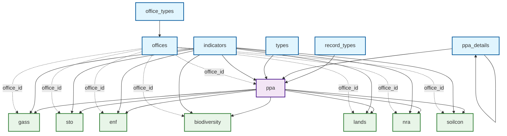
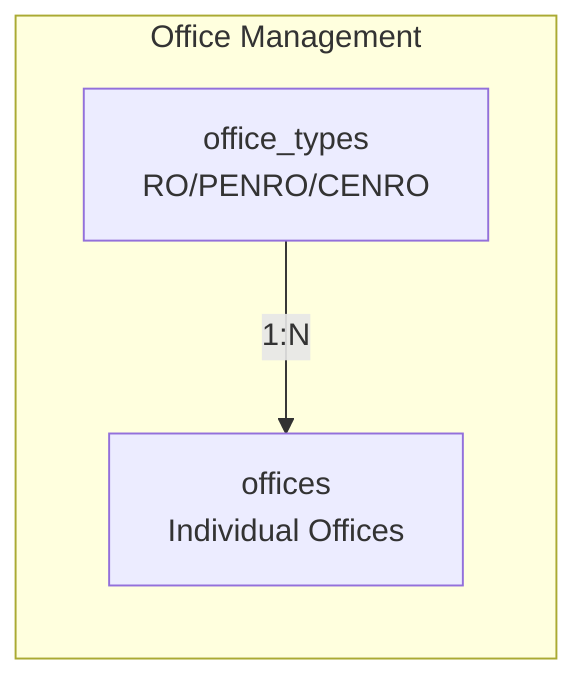
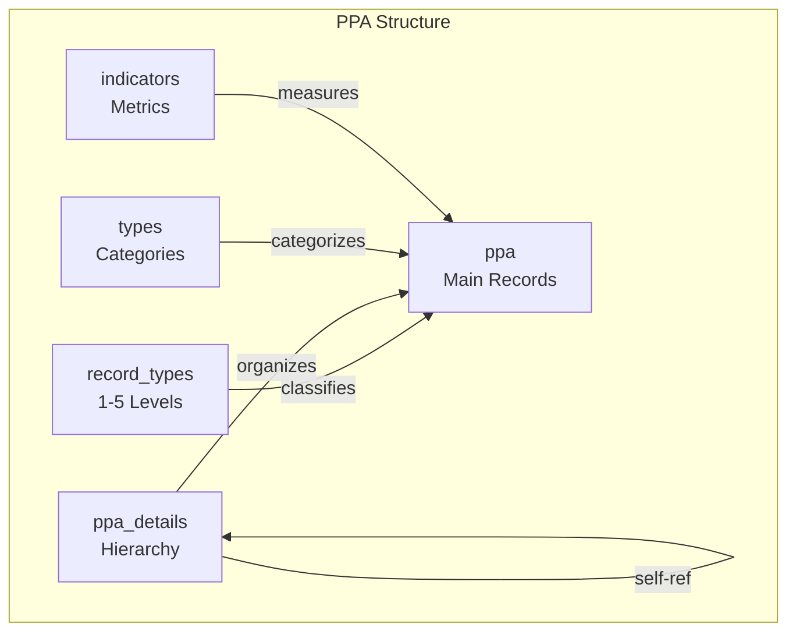
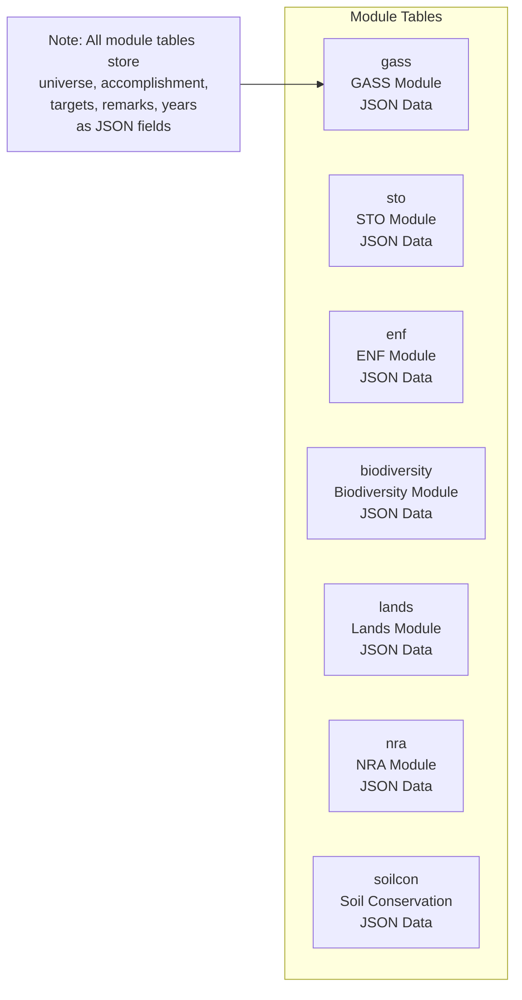
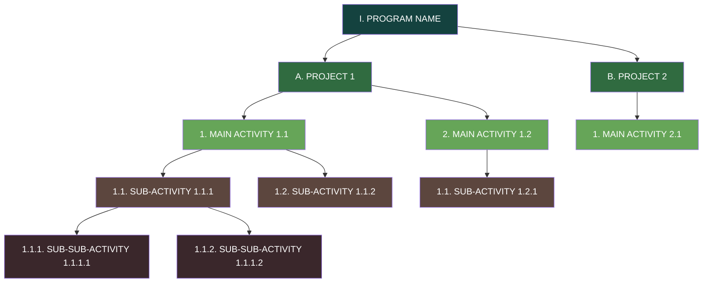
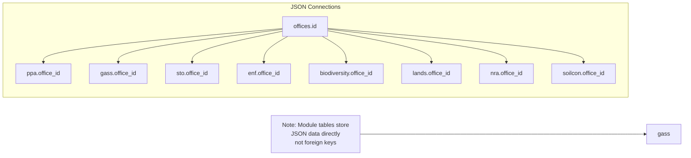
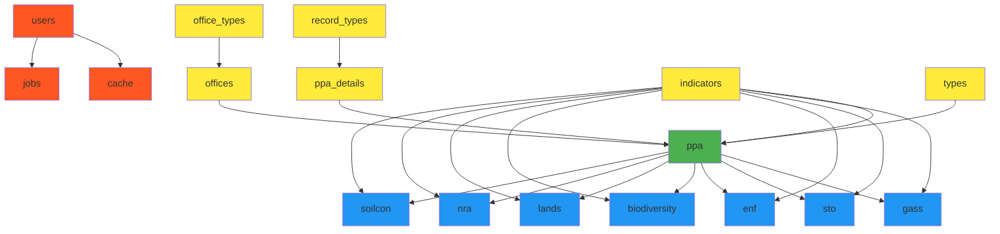
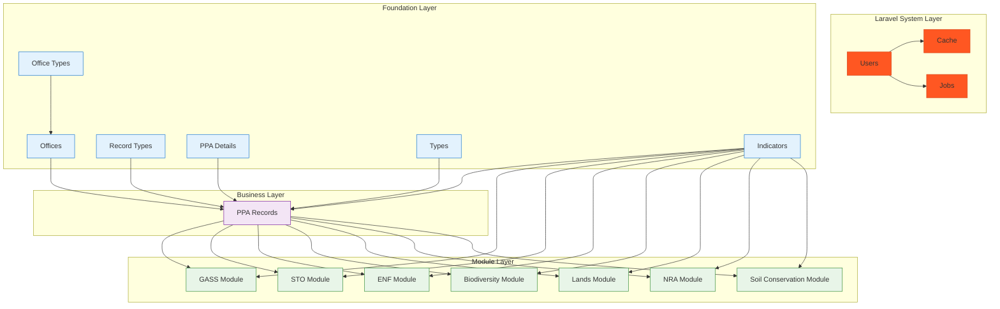

# Database Schema and Diagrams

## Overview
Visual representation of the DENR CAR University Base database structure with relationships and data flow.

---

## Entity Relationship Diagram (ERD)

```mermaid
erDiagram
    %% Laravel System Tables
    users {
        bigint id PK
        string name
        string email UK
        timestamp email_verified_at
        string password
        string remember_token
        timestamp created_at
        timestamp updated_at
    }
    
    cache {
        string key PK
        text value
        timestamp expiration
    }
    
    jobs {
        bigint id PK
        string queue
        text payload
        tinyint attempts
        tinyint reserved_at
        tinyint available_at
        timestamp created_at
    }
    
    %% Office Management
    office_types {
        bigint id PK
        varchar name UK
        text desc
        timestamp created_at
        timestamp updated_at
    }
    
    offices {
        bigint id PK
        varchar name
        bigint office_types_id FK
        timestamp created_at
        timestamp updated_at
    }
    
    %% PPA Structure
    record_types {
        bigint id PK
        varchar name UK
        text desc
        timestamp created_at
        timestamp updated_at
    }
    
    ppa_details {
        bigint id PK
        bigint parent_id FK
        int column_order
        timestamp created_at
        timestamp updated_at
    }
    
    types {
        bigint id PK
        varchar code
        text desc
        timestamp created_at
        timestamp updated_at
    }
    
    indicators {
        bigint id PK
        varchar name
        timestamp created_at
        timestamp updated_at
    }
    
    ppa {
        bigint id PK
        varchar name
        bigint types_id FK
        bigint record_type_id FK
        bigint ppa_details_id FK
        bigint indicator_id FK
        json office_id
        timestamp created_at
        timestamp updated_at
    }
    
    %% Module Tables (all have identical structure)
    gass {
        bigint id PK
        bigint ppa_id FK
        bigint indicator_id FK
        json office_id
        json universe
        json accomplishment
        json targets
        text remarks
        json years
        timestamp created_at
        timestamp updated_at
    }
    
    sto {
        bigint id PK
        bigint ppa_id FK
        bigint indicator_id FK
        json office_id
        json universe
        json accomplishment
        json targets
        text remarks
        json years
        timestamp created_at
        timestamp updated_at
    }
    
    enf {
        bigint id PK
        bigint ppa_id FK
        bigint indicator_id FK
        json office_id
        json universe
        json accomplishment
        json targets
        text remarks
        json years
        timestamp created_at
        timestamp updated_at
    }
    
    biodiversity {
        bigint id PK
        bigint ppa_id FK
        bigint indicator_id FK
        json office_id
        json universe
        json accomplishment
        json targets
        text remarks
        json years
        timestamp created_at
        timestamp updated_at
    }
    
    lands {
        bigint id PK
        bigint ppa_id FK
        bigint indicator_id FK
        json office_id
        json universe
        json accomplishment
        json targets
        text remarks
        json years
        timestamp created_at
        timestamp updated_at
    }
    
    nra {
        bigint id PK
        bigint ppa_id FK
        bigint indicator_id FK
        json office_id
        json universe
        json accomplishment
        json targets
        text remarks
        json years
        timestamp created_at
        timestamp updated_at
    }
    
    soilcon {
        bigint id PK
        bigint ppa_id FK
        bigint indicator_id FK
        json office_id
        json universe
        json accomplishment
        json targets
        text remarks
        json years
        timestamp created_at
        timestamp updated_at
    }

    %% Relationships
    office_types ||--o{ offices : "has many"
    record_types ||--o{ ppa : "classifies"
    ppa_details ||--o{ ppa : "organizes"
    ppa_details ||--o{ ppa_details : "self-reference"
    types ||--o{ ppa : "categorizes"
    indicators ||--o{ ppa : "measures"
    
    %% Module Relationships
    ppa ||--o{ gass : "implements"
    ppa ||--o{ sto : "implements"
    ppa ||--o{ enf : "implements"
    ppa ||--o{ biodiversity : "implements"
    ppa ||--o{ lands : "implements"
    ppa ||--o{ nra : "implements"
    ppa ||--o{ soilcon : "implements"
    
    indicators ||--o{ gass : "tracks"
    indicators ||--o{ sto : "tracks"
    indicators ||--o{ enf : "tracks"
    indicators ||--o{ biodiversity : "tracks"
    indicators ||--o{ lands : "tracks"
    indicators ||--o{ nra : "tracks"
    indicators ||--o{ soilcon : "tracks"
```



---

## Data Flow Diagram



---

## Table Structure Overview

### 1. Office Management Layer


### 2. PPA Hierarchy Layer


### 3. Module System Layer


---

## JSON Field Structures

### PPA Office Assignment
```json
{
  "office_id": [1, 3, 7, 12],
  "description": "Array of office IDs for multi-office PPAs"
}
```

### Module Office Assignment
```json
{
  "office_id": [1, 3, 7],
  "description": "Array of office IDs for multi-office module records"
}
```

### Module Universe Data
```json
{
  "universe": [100, 150, 200],
  "office_id": [1, 3, 7],
  "mapping": "universe[i] ↔ office_id[i]"
}
```

### Module Accomplishment Data
```json
{
  "accomplishment": [50, 75, 100],
  "years": [2022, 2023, 2024],
  "remarks": ["Good", "Excellent", "Needs Improvement"],
  "office_id": [1, 3, 7]
}
```

### Module Target Data
```json
{
  "targets": [120, 180, 250],
  "years": [2027, 2028, 2029]
}
```

---

## Hierarchical PPA Structure



---

## Module Calculation Flow

```mermaid
flowchart LR
    U[Universe Values] -->|per office| CALC[Baseline Calculation]
    ACC[Accomplishments<br/>2022-2026] -->|sum per office| CALC
    CALC --> BASELINE[Baseline<br/>Universe - Accomplishments]
    
    BASELINE -->|display| UI[Module Table<br/>(GASS/STO/ENF/etc.)]
    U -->|CAR total| UI
    ACC -->|CAR total| UI
    TARGETS[Target Values<br/>2027+] -->|CAR total| UI
    
    subgraph CAR Row
        CAR_TOT[CAR Totals<br/>Sum of all offices]
    end
    
    UI --> CAR_TOT
```

---

## Database Connection Points

### Primary Key Relationships

```mermaid
graph LR
    subgraph Foreign Keys
        office_types.id --> offices.office_types_id
        record_types.id --> ppa.record_type_id
        ppa_details.id --> ppa.ppa_details_id
        types.id --> ppa.types_id
        indicators.id --> ppa.indicator_id
        
        %% Module Foreign Keys
        ppa.id --> gass.ppa_id
        ppa.id --> sto.ppa_id
        ppa.id --> enf.ppa_id
        ppa.id --> biodiversity.ppa_id
        ppa.id --> lands.ppa_id
        ppa.id --> nra.ppa_id
        ppa.id --> soilcon.ppa_id
        
        indicators.id --> gass.indicator_id
        indicators.id --> sto.indicator_id
        indicators.id --> enf.indicator_id
        indicators.id --> biodiversity.indicator_id
        indicators.id --> lands.indicator_id
        indicators.id --> nra.indicator_id
        indicators.id --> soilcon.indicator_id
    end
```


### JSON Array Relationships


---

## Data Volume Estimation

### Expected Records per Table
| Table | Estimated Records | Growth Rate |
|-------|------------------|-------------|
| users | 10-50 | Low |
| cache | Variable | High (auto-cleanup) |
| jobs | Variable | Medium |
| office_types | 3-5 | Static |
| offices | 15-20 | Low |
| record_types | 5 | Static |
| ppa_details | 100-500 | Medium |
| types | 10-20 | Low |
| indicators | 200-1000 | High |
| ppa | 500-2000 | High |
| gass | 200-800 | High |
| sto | 200-800 | High |
| enf | 200-800 | High |
| biodiversity | 200-800 | High |
| lands | 200-800 | High |
| nra | 200-800 | High |
| soilcon | 200-800 | High |

---

## Performance Considerations

### Index Strategy
```sql
-- Primary indexes (automatic)
PRIMARY KEY (id)

-- Foreign key indexes
INDEX (office_types_id)
INDEX (record_type_id)
INDEX (ppa_details_id)
INDEX (types_id)
INDEX (indicator_id)
INDEX (ppa_id)

-- JSON field indexes (MySQL 5.7+)
INDEX ((CAST(office_id AS CHAR(255) ARRAY)))
INDEX ((CAST(years AS CHAR(255) ARRAY)))

-- Self-reference index
INDEX (parent_id)
```

### Query Patterns
1. **PPA Hierarchy:** Recursive queries on `ppa_details.parent_id`
2. **Office Filtering:** JSON contains queries on `office_id` arrays
3. **STO Calculations:** JSON array aggregation across multiple tables
4. **Time-based Filtering:** Range queries on `years` JSON fields

---

## Migration Dependencies



---

## Summary Diagram



---

**Created:** May 4, 2026  
**Database Version:** 3.0  
**Diagram Tool:** Mermaid.js  
**Total Tables:** 17  
**Relationships:** 19 Foreign Keys + 8 JSON Arrays
