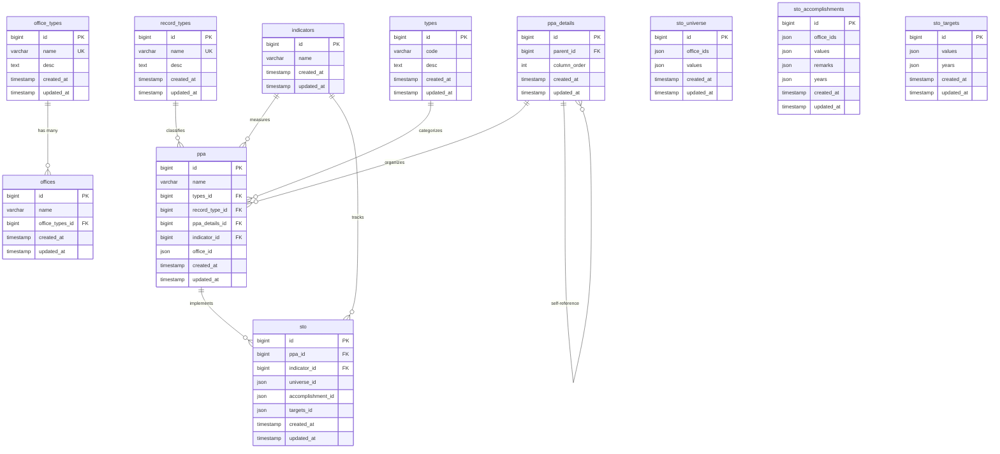
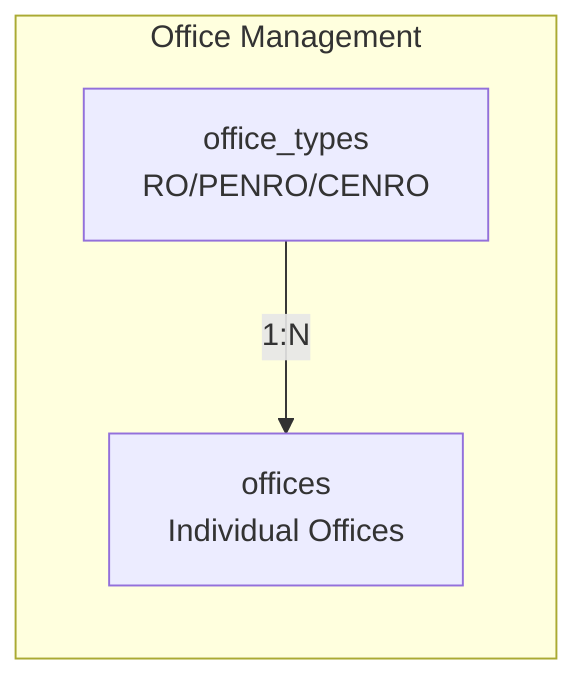
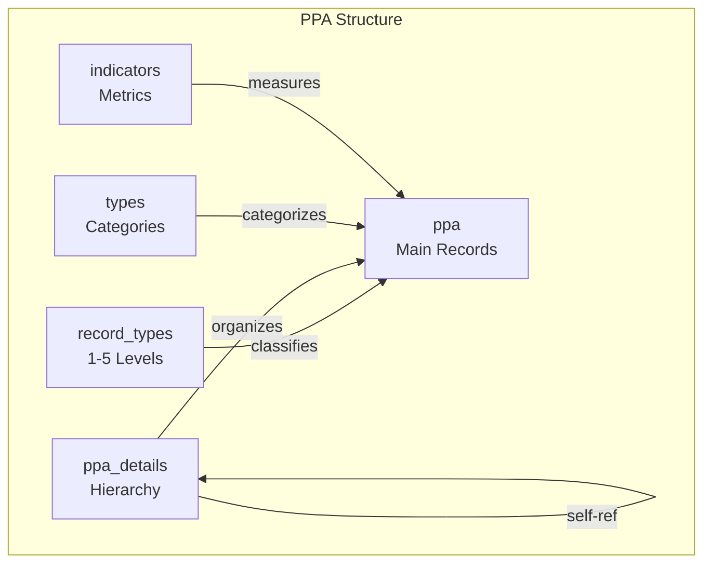
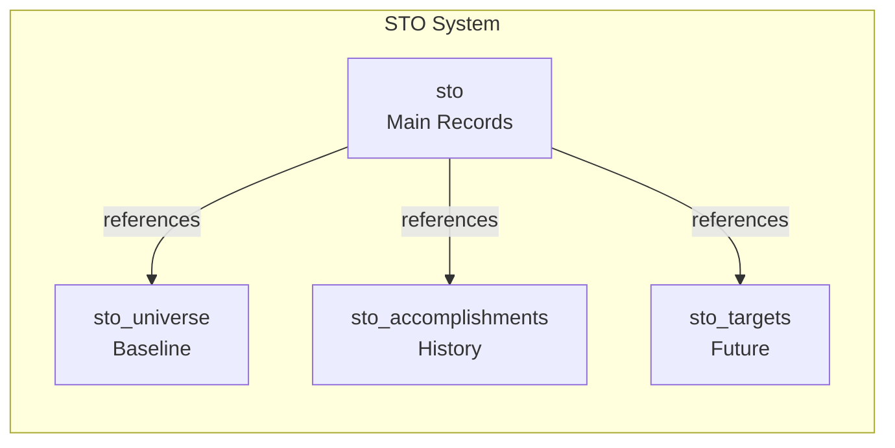
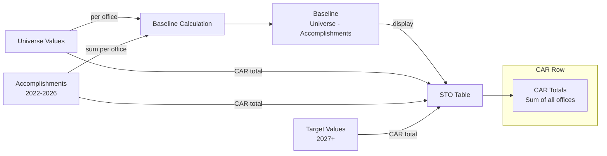
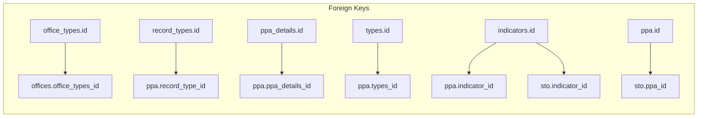
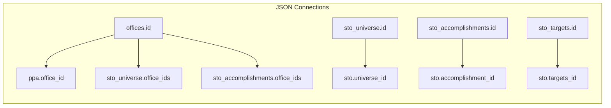

# Database Schema and Diagrams

## Overview
Visual representation of the DENR CAR University Base database structure with relationships and data flow.

---

## Entity Relationship Diagram (ERD)



---

## Data Flow Diagram

```mermaid
flowchart TD
    %% Office Setup
    OT[office_types] --> O[offices]
    
    %% PPA Structure
    RT[record_types] --> P[ppa]
    PD[ppa_details] --> P
    T[types] --> P
    I[indicators] --> P
    
    %% STO System
    P --> STO[sto]
    I --> STO
    
    %% STO Data Tables
    STO --> SU[sto_universe]
    STO --> SA[sto_accomplishments]
    STO --> ST[sto_targets]
    
    %% JSON Connections
    O -.->|office_id| P
    O -.->|office_ids| SU
    O -.->|office_ids| SA
    
    %% Self-reference
    PD --> PD
    
    styling classDef primary fill:#e1f5fe,stroke:#01579b,stroke-width:2px
    styling classDef secondary fill:#f3e5f5,stroke:#4a148c,stroke-width:2px
    styling classDef sto fill:#e8f5e8,stroke:#2e7d32,stroke-width:2px
    
    class OT,O,RT,PD,T,I primary
    class P,STO secondary
    class SU,SA,ST sto
```

---

## Table Structure Overview

### 1. Office Management Layer


### 2. PPA Hierarchy Layer


### 3. STO System Layer


---

## JSON Field Structures

### PPA Office Assignment
```json
{
  "office_id": [1, 3, 7, 12],
  "description": "Array of office IDs for multi-office PPAs"
}
```

### STO Universe
```json
{
  "office_ids": [1, 3, 7],
  "values": [100, 150, 200],
  "mapping": "office_ids[i] ↔ values[i]"
}
```

### STO Accomplishments
```json
{
  "office_ids": [1, 3, 7],
  "values": [50, 75, 100],
  "remarks": ["Good", "Excellent", "Needs Improvement"],
  "years": [2022, 2023, 2024]
}
```

### STO Targets
```json
{
  "values": [120, 180, 250],
  "years": [2027, 2028, 2029],
  "mapping": "values[i] ↔ years[i]"
}
```

---

## Hierarchical PPA Structure

```mermaid
graph TD
    %% Program Level
    P1[I. PROGRAM NAME]
    
    %% Project Level
    P1 --> P2[A. PROJECT 1]
    P1 --> P3[B. PROJECT 2]
    
    %% Main Activity Level
    P2 --> P4[1. MAIN ACTIVITY 1.1]
    P2 --> P5[2. MAIN ACTIVITY 1.2]
    P3 --> P6[1. MAIN ACTIVITY 2.1]
    
    %% Sub Activity Level
    P4 --> P7[1.1. SUB-ACTIVITY 1.1.1]
    P4 --> P8[1.2. SUB-ACTIVITY 1.1.2]
    P5 --> P9[1.1. SUB-ACTIVITY 1.2.1]
    
    %% Sub-Sub Activity Level
    P7 --> P10[1.1.1. SUB-SUB-ACTIVITY 1.1.1.1]
    P7 --> P11[1.1.2. SUB-SUB-ACTIVITY 1.1.1.2]
    
    styling classDef program fill:#14423f,color:white
    styling classDef project fill:#306b40,color:white
    styling classDef main fill:#66a558,color:white
    styling classDef sub fill:#5c463e,color:white
    styling classDef subsub fill:#3a272b,color:white
    
    class P1 program
    class P2,P3 project
    class P4,P5,P6 main
    class P7,P8,P9 sub
    class P10,P11 subsub
```

---

## STO Calculation Flow



---

## Database Connection Points

### Primary Key Relationships


### JSON Array Relationships


---

## Data Volume Estimation

### Expected Records per Table
| Table | Estimated Records | Growth Rate |
|-------|------------------|-------------|
| office_types | 3-5 | Static |
| offices | 15-20 | Low |
| record_types | 5 | Static |
| ppa_details | 100-500 | Medium |
| types | 10-20 | Low |
| indicators | 200-1000 | High |
| ppa | 500-2000 | High |
| sto_universe | 100-300 | Medium |
| sto_accomplishments | 300-1000 | High |
| sto_targets | 200-800 | High |
| sto | 500-2000 | High |

---

## Performance Considerations

### Index Strategy
```sql
-- Primary indexes (automatic)
PRIMARY KEY (id)

-- Foreign key indexes
INDEX (office_types_id)
INDEX (record_type_id)
INDEX (ppa_details_id)
INDEX (types_id)
INDEX (indicator_id)
INDEX (ppa_id)

-- JSON field indexes (MySQL 5.7+)
INDEX ((CAST(office_id AS CHAR(255) ARRAY)))
INDEX ((CAST(years AS CHAR(255) ARRAY)))

-- Self-reference index
INDEX (parent_id)
```

### Query Patterns
1. **PPA Hierarchy:** Recursive queries on `ppa_details.parent_id`
2. **Office Filtering:** JSON contains queries on `office_id` arrays
3. **STO Calculations:** JSON array aggregation across multiple tables
4. **Time-based Filtering:** Range queries on `years` JSON fields

---

## Migration Dependencies

```mermaid
graph TD
    A[office_types] --> B[offices]
    C[record_types] --> D[ppa_details]
    E[indicators] --> F[ppa]
    G[types] --> F
    D --> F
    B --> F
    F --> H[sto]
    E --> H
    I[sto_universe] --> H
    J[sto_accomplishments] --> H
    K[sto_targets] --> H
    
    styling classDef base fill:#ffeb3b
    styling classDef structure fill:#4caf50
    styling classDef sto fill:#2196f3
    
    class A,B,C,D,E,G base
    class F structure
    class H,I,J,K sto
```

---

## Summary Diagram

```mermaid
graph TB
    subgraph Foundation Layer
        OT[Office Types]
        O[Offices]
        RT[Record Types]
        PD[PPA Details]
        T[Types]
        I[Indicators]
    end
    
    subgraph Business Layer
        P[PPA Records]
    end
    
    subgraph Analytics Layer
        STO[STO Records]
        SU[Universe]
        SA[Accomplishments]
        ST[Targets]
    end
    
    OT --> O
    RT --> P
    PD --> P
    T --> P
    I --> P
    O --> P
    P --> STO
    I --> STO
    STO --> SU
    STO --> SA
    STO --> ST
    
    styling classDef foundation fill:#e3f2fd,stroke:#1976d2
    styling classDef business fill:#f3e5f5,stroke:#7b1fa2
    styling classDef analytics fill:#e8f5e8,stroke:#388e3c
    
    class OT,O,RT,PD,T,I foundation
    class P business
    class STO,SU,SA,ST analytics
```

---

**Created:** March 30, 2026  
**Database Version:** 2.0  
**Diagram Tool:** Mermaid.js  
**Total Tables:** 11  
**Relationships:** 12 Foreign Keys + 4 JSON Arrays
